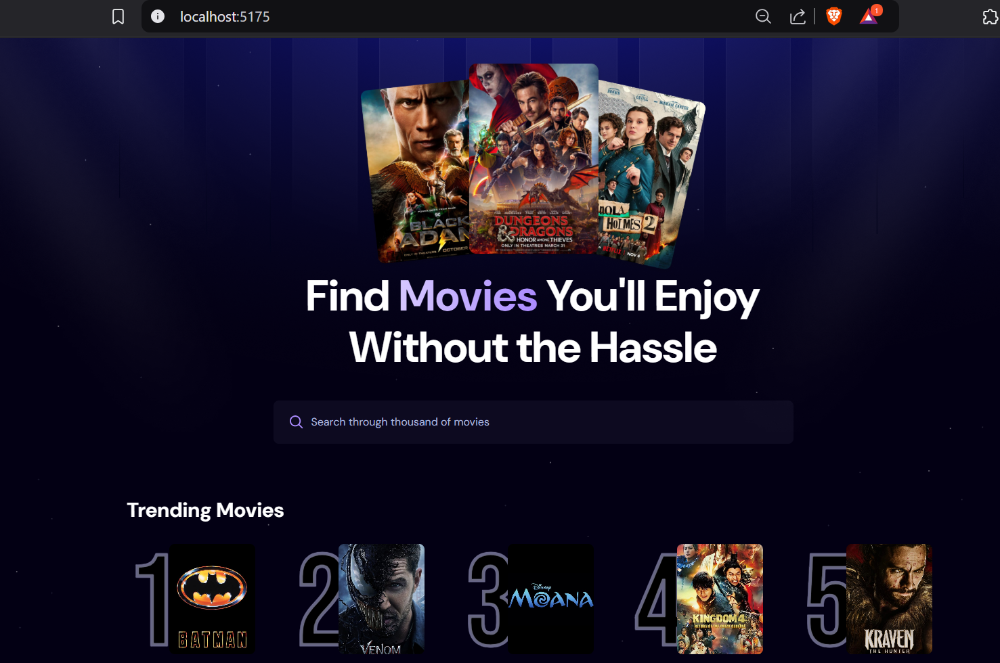
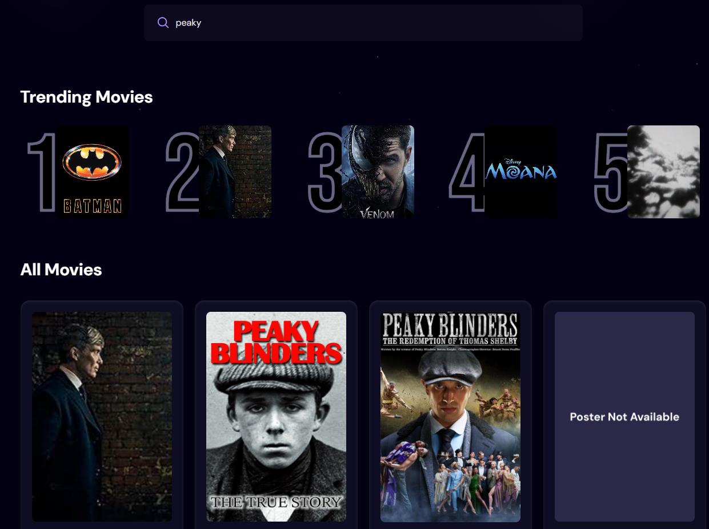
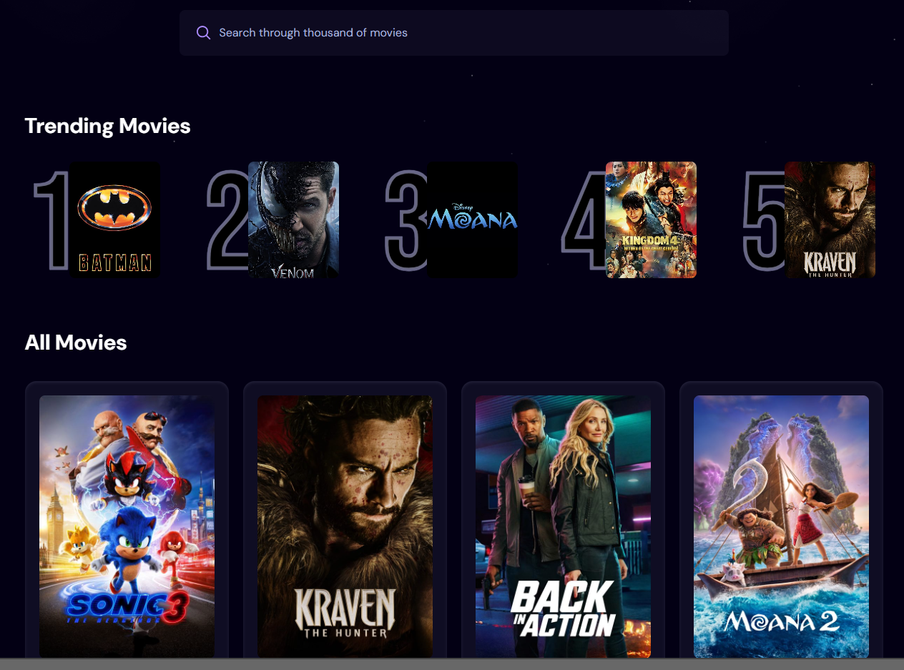

# React + Vite Movie Search App

This project provides a simple and efficient UI for searching movies, displaying trending lists, and managing search data through a custom backend. The app is built using **React**, **Vite**, **TMDB Movie API**, and **Appwrite**.

## Features:
- Search for movies using the **TMDB Movie API**.
- Custom search implementation with **Appwrite** backend to store search counts and movie data.
- Trending movies list based on search count, managed through **Appwrite** database.
- Fully interactive UI powered by **React** and **Vite**.

## Tech Stack:
- **React** - Front-end UI framework
- **Vite** - Build tool for fast development
- **TMDB Movie API** - Provides movie data for search and trending lists
- **Appwrite** - Backend service to store search counts and manage movie data
- **ESLint** - Code linting for better code quality

## Setup & Installation:

1. Clone the repository:
    ```bash
   git clone https://github.com/your-username/movie-search-app.git
2. Install dependencies
    ```bash
   npm install
3. Add environment variables: Create a .env file:
   ```bash
    VITE_TMDB_API_KEY=your_tmdb_api_key
    VITE_APPWRITE_ENDPOINT=your_appwrite_endpoint
    VITE_APPWRITE_PROJECT_ID=your_appwrite_project_id
4. Run the app:
   ```bash
   npm run dev
## Screenshots
Below are some screenshots showing the app in action:

##### Dashboard

  

##### Search

  
##### Trending List
  

## How it Works:
* The app uses the TMDB API to fetch movie data based on user search input.
* All searches are stored in the Appwrite database and the count of each search is incremented.
* A list of trending movies is shown based on the number of searches for each movie, fetched from Appwrite.
* The UI is built with React and Vite for quick and responsive performance.

## Acknowledgements:
* TMDB for the Movie API.
* Appwrite for the backend database service.
* Vite and React for the fast and efficient development experience.

## License

This project is licensed under the MIT License - see the [LICENSE](LICENSE) file for details.
